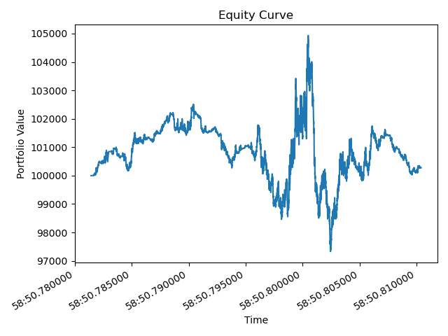

# Performance Report
## Summary Metrics
| Metric | Value |
|---|---|
| Starting Equity | 100000.00 |
| Ending Equity | 100272.01 |
| Total Return | 0.27% |
| Sharpe (per-tick scaled) | 0.14 |
| Max Drawdown | -7.24% |

## Equity Curve


## ASCII Sparkline
```
▃▄▄▄▃▅▅▅▅▅▅▆▅▅▅▆▅▅▅▄▄▄▄▄▄▄▄▄▂▂▁▂▄▅▆█▆▁▂▁▁▂▄▃▄▃▃▃▃▅▄▅▅▅▄▄▄▃▃▃
```
## Executions
- Executed orders: 8390
- Failed orders: 990

### First 5 Executions
```
{'timestamp': '2025-09-21T22:58:50.781440', 'symbol': 'AAPL', 'price': 152.26, 'quantity': 1, 'side': 'BUY', 'status': 'FILLED', 'cash_after': 99847.74, 'position_after': 1}
{'timestamp': '2025-09-21T22:58:50.781498', 'symbol': 'AAPL', 'price': 153.38, 'quantity': 1, 'side': 'SELL', 'status': 'FILLED', 'cash_after': 100001.12000000001, 'position_after': 0}
{'timestamp': '2025-09-21T22:58:50.781498', 'symbol': 'AAPL', 'price': 153.38, 'quantity': 1, 'side': 'BUY', 'status': 'FILLED', 'cash_after': 99847.74, 'position_after': 1}
{'timestamp': '2025-09-21T22:58:50.781509', 'symbol': 'AAPL', 'price': 154.63, 'quantity': 1, 'side': 'SELL', 'status': 'FILLED', 'cash_after': 100002.37000000001, 'position_after': 0}
{'timestamp': '2025-09-21T22:58:50.781509', 'symbol': 'AAPL', 'price': 154.63, 'quantity': 1, 'side': 'BUY', 'status': 'FILLED', 'cash_after': 99847.74, 'position_after': 1}
```

## Interpretation
Based the strategy performance we can make the following observations
- the equity curve shows no consistent positive return; in fact, given the data generated is a martingale, having 0 expected profit is expected due to the optional sampling theorem.
- the volality is really high with significant std and max drawdown.
